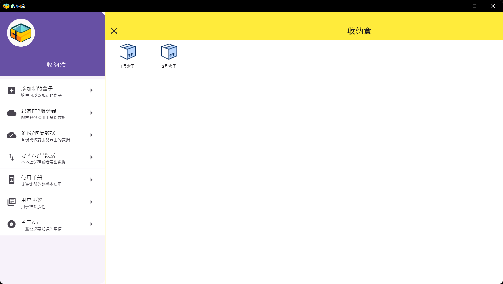

# 收纳盒App
---
> 一、介绍： 
### 收纳盒App是整理和管理物品的好帮手。无论是家庭用品、办公文具、个人物品还是电子零件，这款App帮助您高效地记录和追踪每一个物品的数量。用户可以轻松创建多个收纳盒，添加物品，并通过直观的界面查看详细信息。
---
> 二、功能亮点：
- 简易管理：快速添加和编辑物品，实时更新数量。分类整理：按类别和标签组织物品，轻松找到所需。
- 分享功能：与家人或团队共享箱子信息。
- 结语：无论您是想要保持家庭井井有条，还是希望在办公环境中提高效率，收纳盒App都能满足您的需求！
- 联系方式：Email:2280711844@qq.com
- [感谢认真看完作者吹牛的短文]
---
> 三、Android应用界面截图

---

> 四、版本管理

## V1.0.2 BETA
**新功能：**
- 1.添加了批量删除箱子的功能
- 2.添加了导入导出Excel表格的功能

**修改的Bug:**

- socket获取的箱子数据无法及时显示在主页面的Bug修复了
- 修复了连接房间时输入的IP地址数量超过12个后无法输入的Bug，现在最多输入到255.255.255.255

**预告：**
- 下个版本优化搜索功能，支持公式化搜索
- 下个版本修改已知的Bug

---

## V1.0.1 BETA
**新功能：**
- 1.添加了局域网内设备之间无线发送数据的功能 [Socket服务器] 。数据不上传到外网。
- 2.添加了搜索的零件点进去，箱子里面的零部件名称变成绿色 [因为数据列表本来就是无需列表，无法变成被选模式]

**修改的Bug:**

- 搜索关键词的时候出现大小写字母有区别的问题。现在无论输入大写或者小写都可以搜得到

**预告：**
- 下个版本添加导入导出Excel表格功能
- 下个版本修改已知的Bug

---

## V1.0.0 BETA
**新功能:**
- 无

**修改的Bug:**
- 此版本是应用第一个版本。遇到的Bug和新功能下个版本添加

**预告：**
- 下个版本添加备份功能
- 下个版本修改已知的Bug
---

**提示：**

本软件用Dart语言写的，用的material风格，目前只有Android和Windows版本，如果需要linux版本和iOS版本可以自行生成，修改源代码并发行的时候希望严格遵守App内提到的协议。谢谢。

gitte仓库地址：https://gitee.com/infinite0078/storage_box [github优先更新]
- [Lab: Write your first Flutter app](https://docs.flutter.dev/get-started/codelab)
- [Cookbook: Useful Flutter samples](https://docs.flutter.dev/cookbook)
